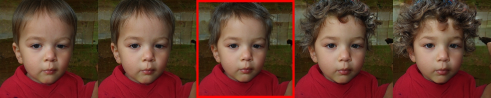

# eCLIPsed


**eCLIPsed: GAN-based image editing using LELSD + CLIP**<br>
Tomás Ebensperger, Julie Favre, and Kepler Warrington-Arroyo.

> Project done as part of the CS-413 Computational Photography course at EPFL.

## Project overview
The aim of this project was to combine the LELSD framework and OpenAI's CLIP to obtain better control of the edits performed by LELSD models. By using CLIP similarity, we were able to influence and guide the training of LELSD models, such that the resulting models are capable of performing effective local edits according to a user-provided text prompt.

## Getting started

The `train_eclipsed.ipynb` notebook in `notebooks`, which can be run from Google Colab, enables users to semi-interactively train models using eCLIPsed and visualize the results in a Streamlit app, which runs from the Colab instance. Note that the same instance can train several models in sequence, provided the CUDA cache is cleared between training sessions. 

### Streamlit apps

> Note that due to the NLP components of the project, some encoding errors may appear in the Streamlit app. We've found that these errors disappear by changing parameters of the app, such as re-selecting the model to use, or changing the value of a slider.

<hr>

```
streamlit run 2D_visualization.py
```

Using this app you can combine two directions found by the model for editing the same semantic and create a palette of
edit like figure bellow. Based on this palette you can choose the edit strengths that will yield your desired edit. Note
that you need to have a eCLIPsed trained model with *num_latent_dirs=2* to use this app.


<hr>

```
streamlit run sequential_editing.py
```

This app allows for more precise editing of a single image.


<hr>

## Acknowledgement

This project relies almost entirely on the [LELSD repository](https://www.github.com/IVRL/LELSD) and associated literature. We would like to thank the CS-413 teaching team for their support, both in class and on this project, and in particular our supervisor Ehsan Pajouheshgar.
